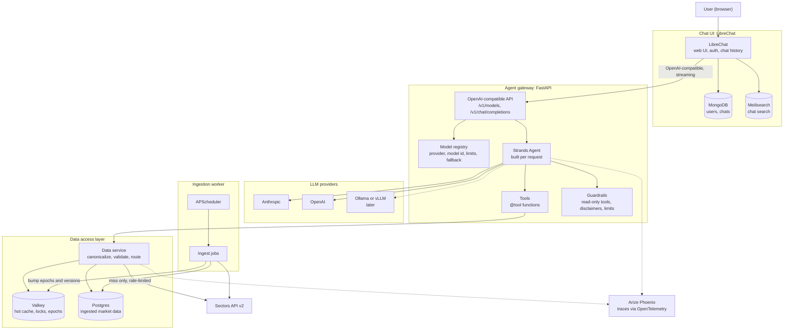
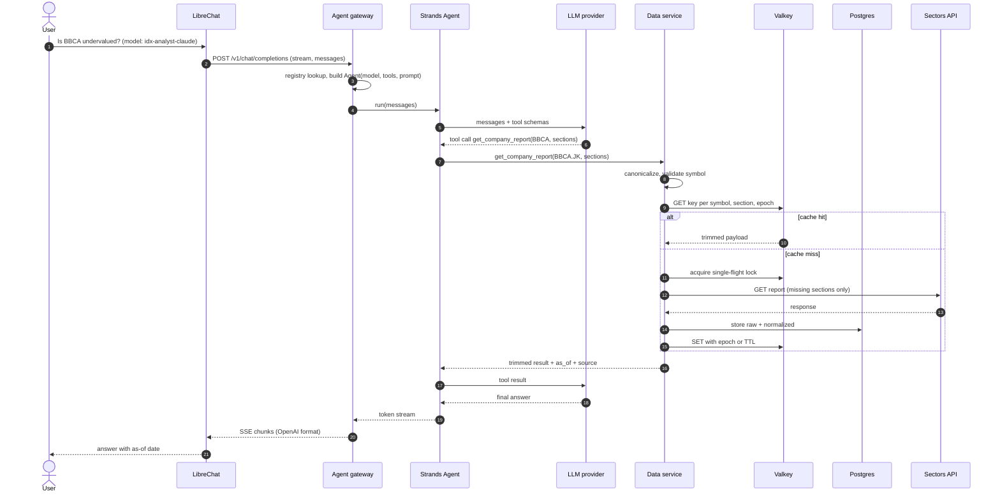
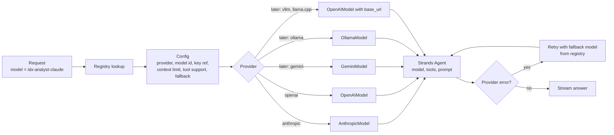
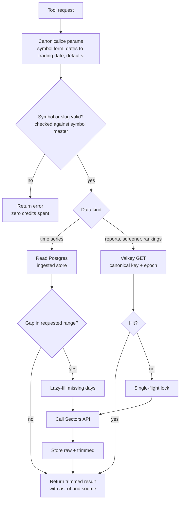
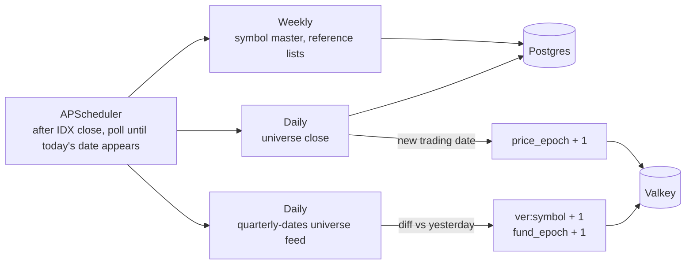
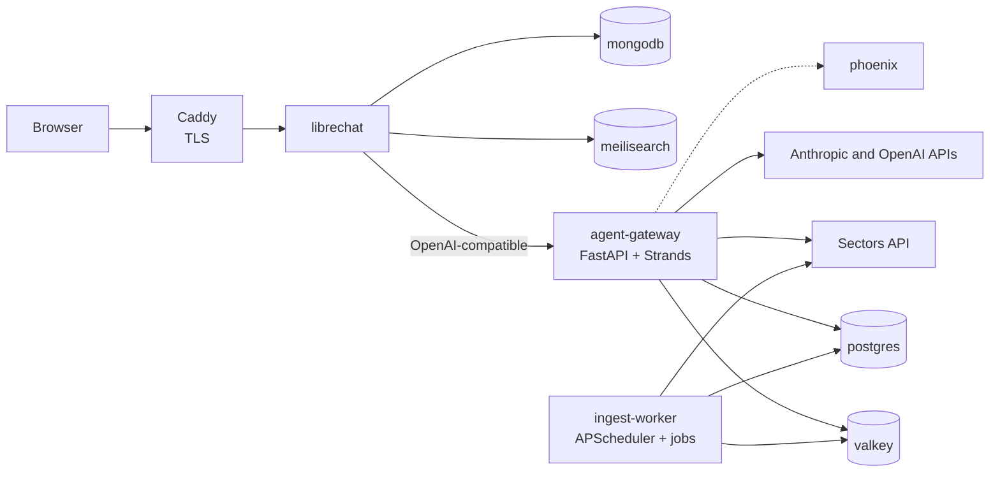

# IDX Finance Agent: Infrastructure

**Stack:** LibreChat (UI) → agent gateway (FastAPI + Strands Agents) → hosted LLMs (local later) → data service (Valkey + Postgres) → Sectors API. IDX only.

**Optimized for:** the fastest path to a working, good-quality first release. Everything not needed for the MVP is listed in section 13 as deferred, not dropped.

**Viewing:** The diagrams are Mermaid blocks. They render on GitHub, GitLab, Obsidian, and VS Code with a Mermaid extension. If your viewer shows raw code, paste a block into <https://mermaid.live>.

**Assumption:** "openstrand" means Strands Agents, the open-source agent SDK.

---

## 1. Decisions

| Decision | Pick | Why |
|---|---|---|
| Language | Python for everything | Strands' Python SDK, data work and the scheduler share one codebase. |
| UI | LibreChat | Multi-model UI, accounts, history and search out of the box. Building a UI from scratch does not fit the time window. |
| Agent loop | Strands Agents behind a FastAPI gateway | Small gateway, and model switching stays under your control. |
| Tools | Plain Strands `@tool` functions | Skip MCP for now. The same functions can be wrapped as an MCP server later. |
| Model access | Native Strands providers, no LiteLLM proxy | One less service, and you keep provider-specific prompt caching, which matters for the token goal. |
| First models | Two hosted providers (Anthropic, OpenAI) | Local models are the riskiest for tool calling and need a GPU. Add one after the evals pass. |
| Cache | Valkey, using the standard Redis client | Open source and protocol-compatible. No semantic cache until there is hit-rate data. |
| Database | Postgres from the pgvector image | Plain tables now. The vector extension is ready if you add news RAG later. |
| Scheduler | APScheduler inside `ingest-worker` | The "poll until today's date appears" logic is custom anyway, so a workflow engine adds little. |
| Observability | Arize Phoenix | Lighter to self-host than Langfuse, and it takes the OpenTelemetry traces Strands emits. |
| Evals | promptfoo, about 15 questions run across every model | Catches tool-calling failures whenever a model is added. |
| Deployment | One VM with Docker Compose | No Kubernetes. |

---

## 2. System overview



---

## 3. How LibreChat connects to the Strands agent

LibreChat can call any OpenAI-compatible API as a custom endpoint. So the agent gateway pretends to be an OpenAI-style model server, and LibreChat treats your whole agent as one selectable "model".

| Gateway piece | Behavior |
|---|---|
| `GET /v1/models` | Returns the names from the model registry: `idx-analyst-claude`, `idx-analyst-gpt` |
| `POST /v1/chat/completions` | Maps `model` to a registry entry, builds a Strands `Agent` with that model, runs it on the incoming `messages`, and streams tokens back as OpenAI-format SSE chunks |
| Auth | Shared secret (bearer key) between LibreChat and the gateway |
| History | LibreChat resends the full message history on every call, so the gateway stays **stateless**. No Strands session store is needed. |
| Tool steps | Not shown by LibreChat by default. Optionally stream a one-line status ("Fetching BBCA report...") as text. |
| Title generation | LibreChat may send extra requests to name conversations. Short-circuit these in the gateway or point them at a cheap model. |

Add this under `endpoints` in `librechat.yaml`:

```yaml
endpoints:
  custom:
    - name: "IDX Analyst"
      apiKey: "${IDX_GATEWAY_KEY}"        # set in .env
      baseURL: "http://agent-gateway:8000/v1"
      models:
        default:
          - "idx-analyst-claude"
          - "idx-analyst-gpt"
          # later: "idx-analyst-gemini", "idx-analyst-local"
      modelDisplayLabel: "IDX Analyst"
```

LibreChat exits on startup if this file fails validation, so validate it before deploying. Mount the file into the container (`docker-compose.override.yml`) and keep keys in `.env`.

---

## 4. One question, end to end



---

## 5. Model switching



**Model registry fields**

| Field | Purpose |
|---|---|
| `name` | Public model name shown in LibreChat |
| `provider`, `model_id` | Which Strands model class and model to use |
| `key_ref` or `base_url` | Secret reference, or host for local and OpenAI-compatible servers |
| `context_limit` | Trim history against this per model |
| `supports_tools` | Refuse or degrade gracefully for models that cannot call tools |
| `tier` | `cheap`, `standard`, `strong`, for routing later |
| `fallback` | Next registry entry to try on provider errors |

**What breaks when you swap models**

- Tool-calling quality varies. Small local models struggle with many tools. Keep the tool set small and run the promptfoo suite against every model you list.
- Prompt caching differs by provider. Keep a stable prompt prefix everywhere.
- Context limits and token counts differ, so trim per model.
- Any cached LLM output (narrative layer, response cache) needs `model_id` and a prompt version in its key. Data-layer caches stay model-independent.
- Tag every trace with the model id to compare cost and quality.

**Later options:** a LiteLLM proxy for many providers, central budgets and fallback chains. A cheap or local model for intent classification with a stronger one for analysis (Strands agents-as-tools or graph patterns).

---

## 6. Inside the data service (routing)



---

## 7. Ingestion and invalidation (MVP jobs)



Old cache keys are never deleted explicitly. Their epoch no longer matches, so they stop being read and expire.

**MVP ingest jobs:** symbol master and reference lists (weekly), universe close (daily), quarterly-dates change detector (daily). Backfill the price store once, after estimating the credit cost.

---

## 8. Deployment (Docker Compose, one VM)



| Service | Role | Notes |
|---|---|---|
| `proxy` | TLS, rate limiting | Only public entry point |
| `librechat` | Chat UI, user accounts, chat history | Needs MongoDB. Meilisearch powers chat search. Its optional RAG API is not needed, because your data layer does retrieval. |
| `mongodb`, `meilisearch` | LibreChat's own stores | Keep separate from market data |
| `agent-gateway` | FastAPI, Strands agent, tool layer, data service | Holds the Sectors API key and all LLM keys. Not public, reachable only from `librechat` |
| `ingest-worker` | Scheduled ingestion, change detector | Separate container so a slow job never blocks chat |
| `valkey` | Cache, locks, epochs | Set `maxmemory` and an eviction policy |
| `postgres` | Ingested market data | Use the pgvector image so news RAG is possible later |
| `phoenix` | Tracing and cost | Receives OpenTelemetry traces |
| `ollama` or `vllm` | Local LLM | **Later.** Needs a GPU for real use |

---

## 9. Agent tools

Few, high-level tools with constrained parameters, so models of any size choose well and cache keys collide more often.

| Tool | Phase | Backed by | Params (constrained) |
|---|---|---|---|
| `screen_companies` | **MVP** | Screener cache | structured `where`, `order_by`, `limit` from a field list |
| `get_company_report` | **MVP** | Company Report cache | `symbol`, `sections[]` (enum) |
| `get_price_history` | **MVP** | Postgres price store | `symbol`, `period` preset (1m, 3m, 1y) |
| `get_market_movers` | **MVP** | Rankings cache | `classification`, `period` enum |
| `get_financials` | Later | Quarterly financials cache | `symbol`, `period` |
| `get_flows` | Later | Postgres foreign-flow and broker stores | `symbol`, `period` preset |
| `get_news` | Later | Postgres news and filings | `symbol`, `tags[]`, `days` |
| `get_corporate_actions` | Later | Postgres calendar | `symbol` or date window |

---

## 10. Repo layout

```
idx-agent/
├── docker-compose.yml
├── docker-compose.override.yml   # mounts librechat.yaml
├── librechat.yaml
├── .env                          # keys: Sectors, LLMs, gateway secret
├── gateway/                      # FastAPI, /v1 endpoints, registry, Strands agent, tools
├── data/                         # data service: canonical keys, cache, DB access, Sectors client (shared)
├── ingest/                       # APScheduler jobs, change detector
├── evals/                        # promptfoo config and ~15 test questions
└── models.yaml                   # model registry
```

`data/` is a shared package imported by both `gateway/` and `ingest/`, so canonicalization and key logic exist in one place.

---

## 11. UI decision

| Option | Fit | Trade-off |
|---|---|---|
| **LibreChat** (chosen) | Multi-model UI, accounts, history, search. Point it at the gateway and you are done. | A generic chat UI: markdown, not custom finance widgets. Tool progress is not shown natively. |
| Open WebUI | Similar idea: connect an OpenAI-compatible backend | Check its current license terms |
| Chainlit | Shows agent steps natively | You build and host more yourself |
| Custom Next.js | Full control, custom charts and tables | Slowest. Not for a tight window |

If you later need charts or custom widgets, add a custom front end against the same gateway.

---

## 12. Guardrails and boundaries

- All API keys (Sectors and every LLM) live only in `agent-gateway` and `ingest-worker`. LibreChat holds only the gateway secret.
- Every answer carries `as_of` and `source`, plus a not-financial-advice line.
- Tools are read-only. There are no write or trade tools.
- Per-user rate limits at the proxy, plus one shared token bucket for outbound Sectors API calls.
- Personal data (watchlists, portfolios) stays out of shared caches.
- Check the Sectors data-licensing terms before serving cached data to many users.

---

## 13. Scope

**MVP**
- Tools: `screen_companies`, `get_company_report`, `get_price_history`, `get_market_movers`.
- Ingest: symbol master, universe close, quarterly-dates change detector.
- Caches: company report (per symbol and section) and screener (canonical key, epochs).
- Models: Anthropic and OpenAI, with fallback between them.
- Evals: about 15 promptfoo questions run on every model.

**Deferred on purpose**
MCP server, LiteLLM proxy, local models, Gemini, semantic cache, RAG over news, Langfuse, multi-agent routing, custom UI, nightly prewarm, and the broker, foreign-flow, news, filings and corporate-actions feeds.

## 14. Build order

1. Run LibreChat with one hosted model directly, to confirm the UI, auth and deployment work.
2. Build the gateway with one Strands agent and one tool (`get_company_report`). Point LibreChat at it as a custom endpoint.
3. Add the data service: symbol master, canonical keys, Valkey cache, single-flight lock.
4. Add the model registry and the second provider. Run the eval suite on both.
5. Add the daily ingest (universe close, quarterly-dates change detector) and `get_price_history`.
6. Add `screen_companies` and `get_market_movers`.
7. Turn on Phoenix tracing and check cache hit rates.

## 15. To verify

- Whether LibreChat can pass the logged-in user's id to the endpoint (for per-user limits), and how it handles streaming tool steps.
- LibreChat's and Open WebUI's current license terms.
- Exact Strands model class names and constructor arguments for each provider.
- Strands streaming events and how to map them to OpenAI-format chunks.
- Sectors API: whether universe feeds include volume and market cap, page size and credit cost per page, section list and per-section pricing on Company Report, when daily data lands after close, and whether an empty `where` works for the symbol-master sweep.
